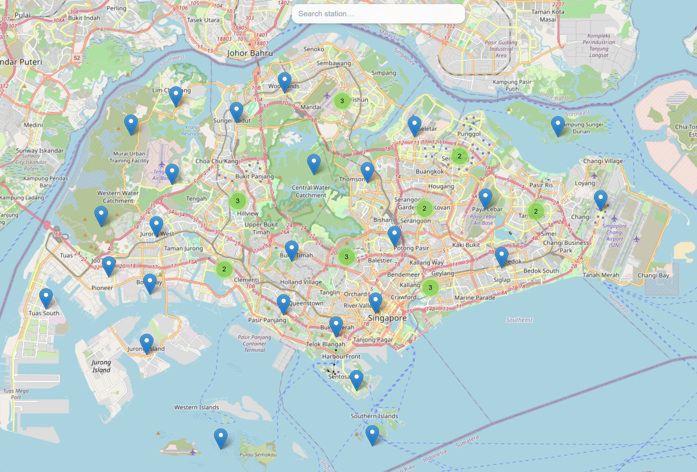
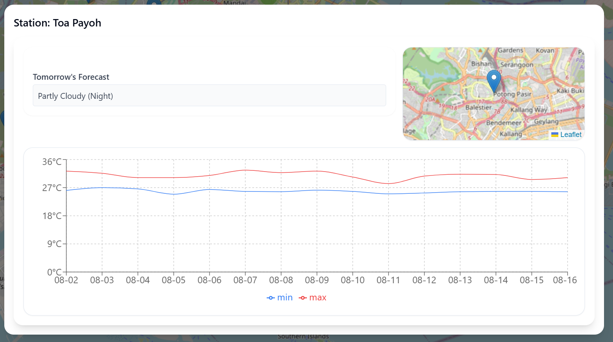
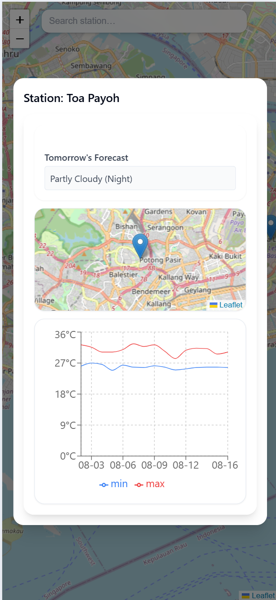

# Singapore Weather App
A tiny Vite + React + TypeScript app for exploring weather at stations on an interactive map. It’s mobile-friendly (responsive layout, touch-ready) and uses Tailwind + shadcn-ui for a clean UI.

Features

🗺️ Interactive map with clustered station markers (Leaflet)

🔎 Search with autocomplete — pan to station on select

🌤️ Weather modal with 2-week min/max line chart + forecast text

📱 Responsive: works great on phones

🎨 Modern UI (Tailwind, shadcn-ui)

Requirements

npm — install with nvm

Quick Start
# 1) Clone
git clone https://github.com/JosephSkippy/Singapore-Weather-App.git

# 2) Enter project
cd Singapore-Weather-App

# 3) Install deps
npm i

# 4) Start dev server (auto-reload)
npm run dev

Scripts

npm run dev – start dev server

npm run build – production build

npm run preview – preview production build

npm test – run unit tests (Vitest + Testing Library)

Tech Stack

Vite • TypeScript • React • Leaflet • Recharts • Tailwind CSS • shadcn-ui • Vitest

| Main View | Desktop | Mobile |
| --- | --- | --- |
|  |  |  |
